# 🔦 Crawler Inspector — Робот-телеинспектор вентиляции

> **Самодельный автономный краулер для осмотра вентиляционных каналов**  
> Платформа T101 · ESP32-CAM · Arduino UNO R3 · Wi-Fi управление · Автопилот · Запись видео · Лог маршрута

[](https://www.arduino.cc/)
[](https://www.espressif.com/)
[](LICENSE)
[](CHANGELOG.md)

---

## 📸 Фотографии устройства

| | | |
|:---:|:---:|:---:|
| 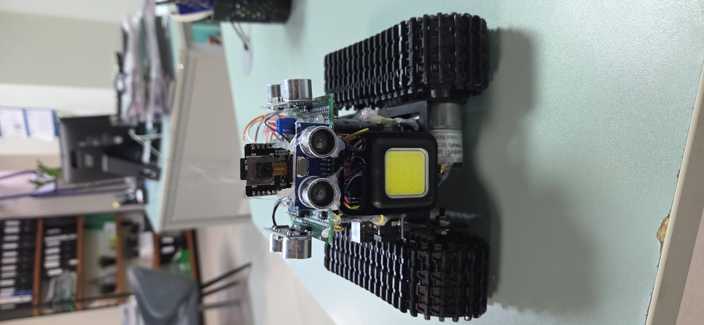 | 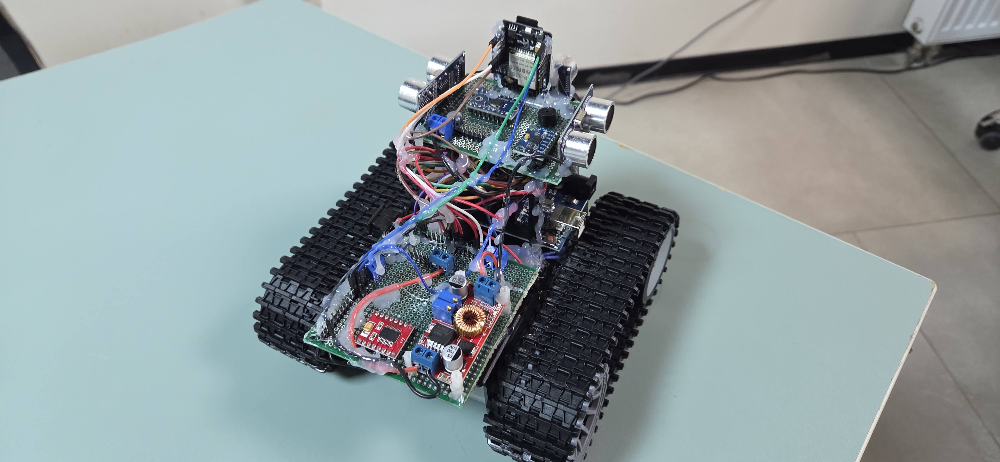 | 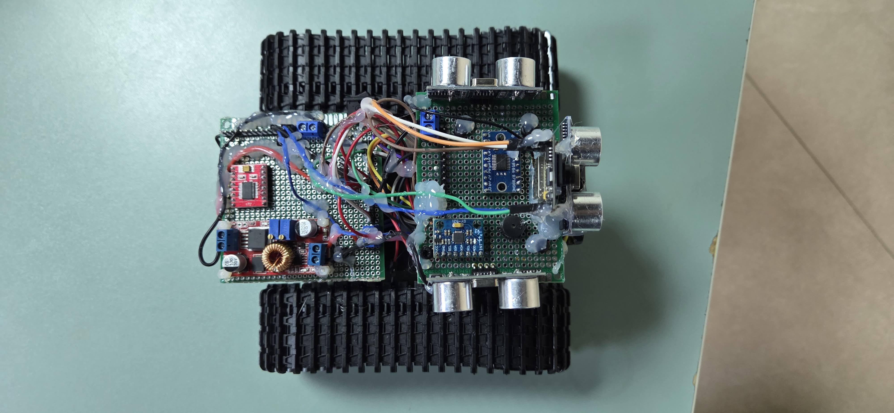 |
| *Вид спереди* | *Вид сзади* | *Вид сверху* |
|  | 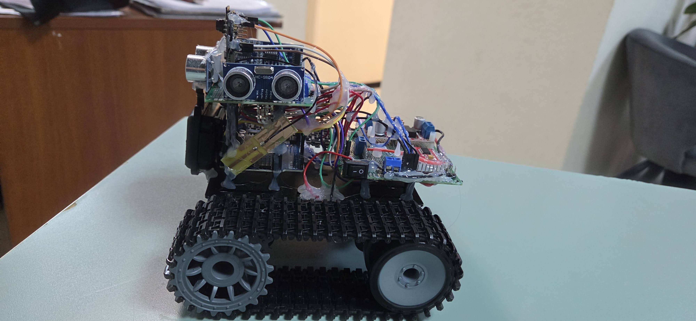 | 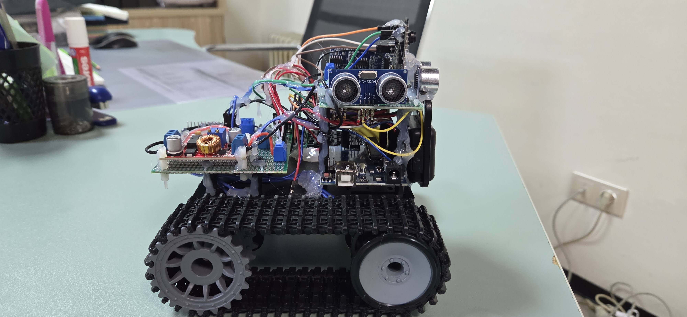 |
| *Вид снизу* | *Левый борт* | *Правый борт* |
| 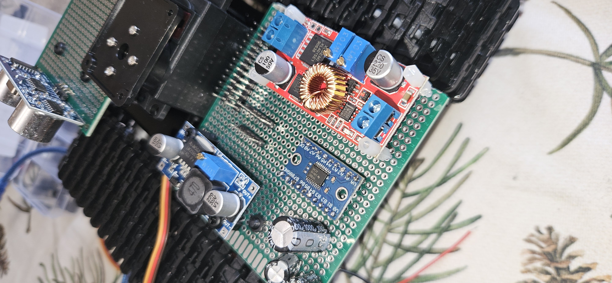 | 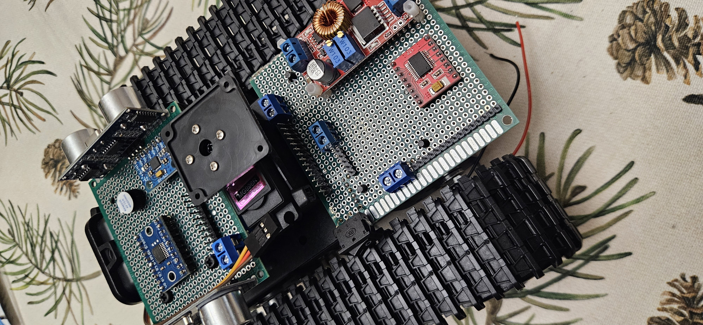 | 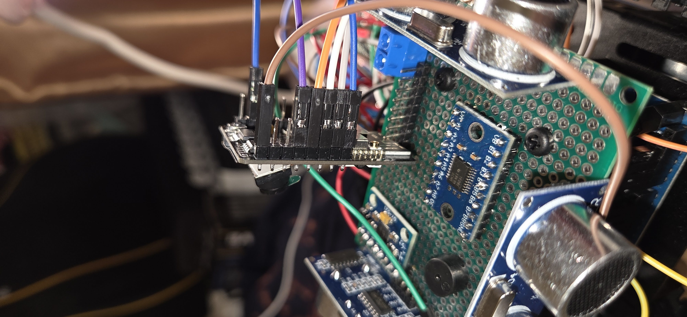 |
| *Электроника* | *Камера и серво* | *В работе* |

---

## 📋 Содержание

1. [О проекте](#о-проекте)
2. [Архитектура системы](#архитектура-системы)
3. [Список компонентов](#список-компонентов)
4. [Схема подключений](#схема-подключений)
5. [Сборка шасси Mini T101](#сборка-шасси-mini-t101)
6. [Монтаж электроники](#монтаж-электроники)
7. [Пайка и коммутация](#пайка-и-коммутация)
8. [Загрузка прошивки](#загрузка-прошивки)
9. [Калибровка](#калибровка)
10. [Первое включение и тестирование](#первое-включение-и-тестирование)
11. [Веб-интерфейс управления](#веб-интерфейс-управления)
12. [Автопилот и конечный автомат](#автопилот-и-конечный-автомат)
13. [Защита от спуска](#защита-от-спуска)
14. [Одометрия и лог маршрута CSV](#одометрия-и-лог-маршрута-csv)
15. [Конвертация записи в видео](#конвертация-записи-в-видео)
16. [Зуммер-сигнализация](#зуммер-сигнализация)
17. [Описание прошивки Arduino](#описание-прошивки-arduino)
18. [Описание прошивки ESP32-CAM](#описание-прошивки-esp32-cam)
19. [Диагностика неисправностей](#диагностика-неисправностей)
20. [Конфигурационные параметры](#конфигурационные-параметры)
21. [Структура репозитория](#структура-репозитория)
22. [Зависимости и библиотеки](#зависимости-и-библиотеки)
23. [История версий (CHANGELOG)](#история-версий-changelog)
24. [Лицензия и вклад в проект](#лицензия-и-вклад-в-проект)

---

## 🤖 О проекте

**Crawler Inspector** — это самодельный робот-телеинспектор, предназначенный для видеоосмотра вентиляционных каналов и других труднодоступных пространств. Основная задача — заменить ручную инспекцию вентиляции в жилых и промышленных зданиях без дорогостоящего профессионального оборудования.

Оператор управляет роботом через браузер (смартфон или ноутбук) по Wi-Fi, видя прямую трансляцию с камеры. При потере сигнала или нажатии AUTO робот самостоятельно продолжает движение до 20 минут, логируя маршрут в CSV-файл. На конце страховочного троса оператор физически вытягивает краулер.

### Ключевые возможности v2.0

| Возможность | Описание |
|---|---|
| **Wi-Fi управление** | Браузерный интерфейс с джойстиком, работает на смартфоне и ноутбуке |
| **MJPEG видеопоток** | Прямая трансляция с камеры OV2640 (320×240 или 640×480) |
| **Автономный автопилот** | Автоматическая езда по коридору с огибанием препятствий |
| **PTZ-камера** | Поворот камеры 45–135° сервоприводом MG996R |
| **Запись на SD** | Автостарт сохранения JPEG-кадров (5 fps) при включении |
| **Защита от спуска** | Обнаружение наклона >30° через MPU6050, аварийная остановка |
| **Лог маршрута CSV** | Одометрия, накопленное рыскание, события, показания датчиков |
| **Зуммер-сигнализация** | Паттерны SOS, BEACON, CRAWL, ABANDONED для разных ситуаций |
| **JSON /status API** | Эндпоинт статуса для внешних систем мониторинга |

### Сценарий применения

Краулер предназначен для работы с крыш и верхних точек зданий, где вентиляционные каналы уходят вниз. Оператор управляет роботом вручную, пока есть Wi-Fi сигнал (обычно 3–4 метра в металлическом коробе), затем робот автоматически переходит в режим автопилота и продолжает движение самостоятельно. По окончании маршрута или при обнаружении тупика / спуска подаётся сигнал зуммером. Оператор вытягивает робота за страховочный трос, прикреплённый к шасси. На SD-карте остаются видеокадры и CSV-лог с картой маршрута.

---

## 🏗 Архитектура системы

```
╔══════════════════════════════════════════════════════════════════════════╗
║                          CRAWLER INSPECTOR v2.0                          ║
║                                                                          ║
║  ┌──────────────────────┐  UART 9600 бод  ┌──────────────────────────┐   ║
║  │    ESP32-CAM          │◄──────────────►│    Arduino UNO R3        │   ║
║  │    (Master)           │   TXS0108E     │    (Slave)               │   ║
║  │                       │   3.3V ↔ 5V    │                          │   ║
║  │  • Wi-Fi AP           │                │  • TB6612FNG (моторы)    │   ║
║  │  • Веб-сервер :80    │ F,B,L,R,S,P,H   │  • HC-SR04 × 3           │   ║
║  │  • MJPEG :81         │◄───────────────►│  • MPU6050 (pitch+yaw)   │   ║
║  │  • SD-карта (запись) │  LOG:EVT,...    │  • Servo MG996R          │   ║
║  │  • CSV лог маршрута  │  REC_AUTO       │  • Зуммер                │   ║
║  └──────────────────────┘                 └──────────────────────────┘   ║
╚══════════════════════════════════════════════════════════════════════════╝
```

**Ролевое разделение:**

- **ESP32-CAM (Master)** — управляет Wi-Fi, стримингом видео, записью на SD, CSV-логом маршрута. Отправляет команды на Arduino и принимает LOG-строки.
- **Arduino UNO (Slave)** — управляет моторами, ультразвуковыми датчиками, IMU, сервоприводом и зуммером. Выполняет всю логику конечного автомата.

---

## 🛒 Список компонентов

| Компонент | Кол-во | Назначение |
|---|:---:|---|
| Шасси Mini T101 (гусеничное) | 1 | Платформа робота |
| ESP32-CAM AI-Thinker | 1 | Мастер: Wi-Fi, камера, SD |
| Arduino UNO R3 | 1 | Слейв: управление периферией |
| TB6612FNG (модуль) | 1 | Драйвер двух моторов |
| Моторы 33GB-520 (под T101) | 2 | Привод гусениц |
| HC-SR04 | 3 | УЗ-дальномеры (перед, лево, право) |
| MPU6050 | 1 | Акселерометр + гироскоп (pitch/yaw) |
| Servo MG996R | 1 | Поворот камеры 0–180° |
| TXS0108E (модуль) | 1 | Согласование уровней 3.3V / 5V |
| MicroSD-карта FAT32 (≤32 ГБ) | 1 | Запись JPEG + CSV лог |
| Преобразователь XL4015 | 1 | Step-down до 5.0 В |
| Аккумулятор LiPo 2S (или 3S) | 1 | Питание |
| Зуммер пассивный 5 В | 1 | Звуковая сигнализация |
| MB-плата для ESP32-CAM | 1 | Загрузка прошивки |
| Нейлоновые стойки M3 | 8 | Крепление плат |
| Страховочный трос | 1 | Извлечение робота (обязательно!) |

---

## 🔌 Схема подключений

### Arduino UNO R3 (актуальная распиновка v2.0)

> ⚠️ В коде v2.0 распиновка моторов **изменена** относительно заголовочного комментария. Актуальные значения из `#define`:

| Пин Arduino | Функция | Комментарий |
|---|---|---|
| **D2** | Servo MG996R (сигнал) | Поворот камеры |
| **D3** | TB6612 BIN2 (мотор B) | |
| **D4** | TB6612 BIN1 (мотор B) | |
| **D5** | TB6612 PWMB (мотор B) | ШИМ правого мотора |
| **D6** | TB6612 PWMA (мотор A) | ШИМ левого мотора |
| **D7** | TB6612 AIN1 (мотор A) | |
| **D8** | TB6612 AIN2 (мотор A) | |
| **D9** | Зуммер (пассивный) | `tone()` 2000 Гц |
| **D10** | SoftwareSerial RX ← TXS0108E | Приём от ESP32 |
| **D11** | SoftwareSerial TX → TXS0108E | Отправка на ESP32 |
| **D12** | HC-SR04 RIGHT TRIG | УЗ правый |
| **D13** | HC-SR04 RIGHT ECHO | УЗ правый |
| **A0** | HC-SR04 FRONT TRIG | УЗ передний |
| **A1** | HC-SR04 FRONT ECHO | УЗ передний |
| **A2** | HC-SR04 LEFT TRIG | УЗ левый |
| **A3** | HC-SR04 LEFT ECHO | УЗ левый |
| **A4 (SDA)** | MPU6050 SDA | I2C, адрес 0x68 |
| **A5 (SCL)** | MPU6050 SCL | I2C |
| **5V** | TB6612 STBY | Всегда включён |

### ESP32-CAM (UART к TXS0108E)

| ESP32-CAM GPIO | Направление | TXS0108E | Arduino |
|---|---|---|---|
| GPIO1 (TX0) | → | A1 → B1 | D10 (RX) |
| GPIO3 (RX0) | ← | A2 ← B2 | D11 (TX) |
| 3.3V | | VCCA + OE | |
| GND | | GND | GND |

> **Питание TXS0108E:** VCCA = 3.3V (от ESP32), VCCB = 5V (от Arduino), OE = 3.3V.

### Схемы пайки

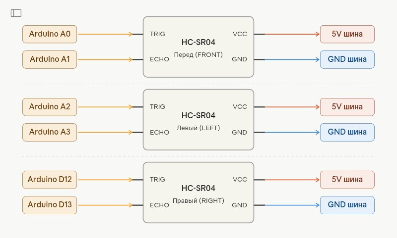
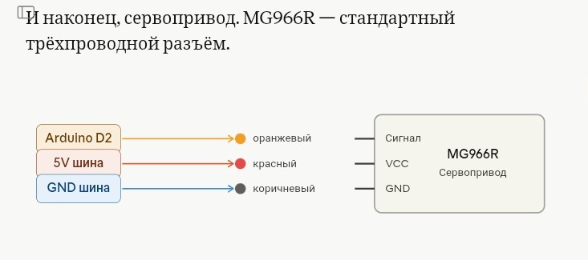
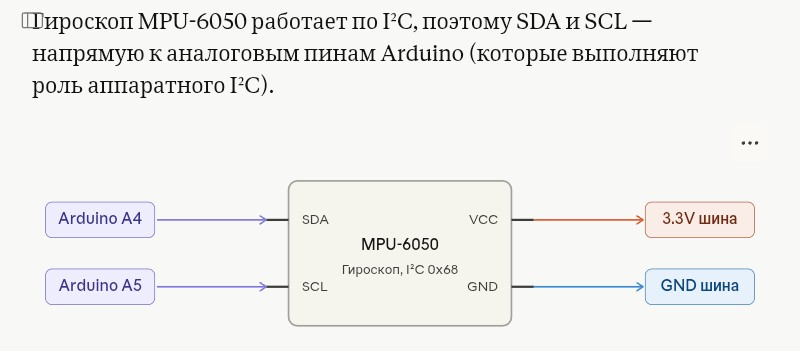
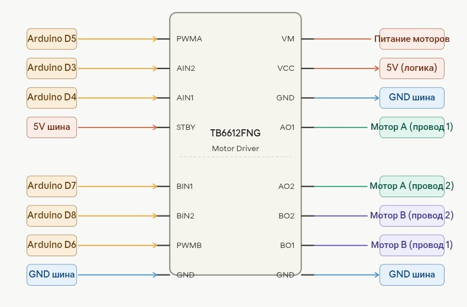
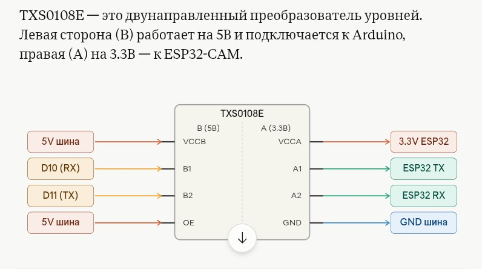

---

## 🔧 Сборка шасси Mini T101

1. Собери шасси T101 с моторами 33GB-520 по инструкции производителя
2. Установи нейлоновые стойки M3 на монтажную плату
3. Закрепи TB6612FNG на стойках над корпусом
4. Размести Arduino UNO под основной платой
5. Установи ESP32-CAM на сервоплатформу спереди
6. Закрепи MG996R для поворота камеры (угол 45–135°)
7. Прикрути три HC-SR04: спереди по центру, слева, справа
8. Закрепи MPU6050 горизонтально по оси движения робота

---

## ⚡ Монтаж электроники

1. Настрой XL4015 на выходное напряжение **5.00 В** мультиметром до подключения нагрузки
2. Припаяй шины питания: 5V и GND на монтажной плате
3. Подключи TB6612FNG к Arduino согласно таблице выше
4. Подключи TXS0108E между ESP32 и Arduino
5. Подключи три HC-SR04 к Arduino
6. Подключи MPU6050 по I2C (A4/A5)
7. Подключи серво MG996R к D2 и 5V
8. Подключи зуммер к D9 и GND
9. Вставь SD-карту (FAT32, ≤32 ГБ) в ESP32-CAM

---

## 🛠 Загрузка прошивки

### Arduino UNO

```
1. Открой Arduino_UNO_Slave_v5.ino в Arduino IDE
2. Плата: Tools → Board → Arduino UNO
3. Порт: выбери COM-порт Arduino
4. Загрузи (Ctrl+U)
```

### ESP32-CAM

> ⚠️ **После загрузки через MB-плату: отключи USB-кабель перед подключением Arduino к UART. Иначе Arduino будет принимать USB-мусор вместо команд.**

```
1. Открой ESP32_CAM_Master_v5.ino в Arduino IDE
2. Установи пакет: Tools → Board Manager → "ESP32 by Espressif Systems" ≥ 2.0
3. Плата: AI-Thinker ESP32-CAM
4. Подключи MB-плату, переведи ESP32 в режим загрузки (IO0 → GND)
5. Загрузи, затем нажми кнопку Reset на ESP32-CAM
6. Отключи USB-кабель MB-платы
7. Подключи провода UART к Arduino
```

---

## 📐 Калибровка

### SPEED_MPS — одометрия (обязательно!)

Скорость `SPEED_MPS` используется для расчёта пройденного расстояния в одометрии и CSV-логе маршрута. Некалиброванное значение даст неточный лог.

```
1. Поставь краулер на ровную поверхность
2. Отметь стартовую точку маркером
3. Включи питание, подключись к Wi-Fi Crawler_Inspector
4. Нажми F (вперёд) и засеки точное время до 1 метра
5. SPEED_MPS = 1.0 / время_в_секундах
   Пример: проехал 1 м за 4.0 с → SPEED_MPS = 0.25f  (уже настроено)
6. Обнови значение в Arduino_UNO_Slave_v5.ino и перезагрузи
```

### Балансировка моторов

Если робот ведёт в сторону при движении вперёд, откорректируй масштаб мотора:

```cpp
#define MOTOR_L_SCALE   1.00f   // левый мотор (не трогать)
#define MOTOR_R_SCALE   0.90f   // уменьши, если правый быстрее
```

---

## ▶️ Первое включение и тестирование

```
1. Вставь SD-карту (FAT32, ≤32 ГБ) в ESP32-CAM
2. Прикрепи страховочный трос к шасси (обязательно!)
3. Включи питание — зуммер даст 2 пика (самотест OK)
4. Подожди 3–4 секунды инициализации
5. Подключись к Wi-Fi: "Crawler_Inspector" / "crawler123"
6. Открой браузер: http://192.168.4.1
7. Убедись что видеопоток запустился (статус 🟢 Видео: ОК)
8. Проверь что надпись "● REC" мигает (автозапись активна)
9. Протестируй движение джойстиком в ручном режиме
10. Откалибруй SPEED_MPS по реальному замеру (см. выше)
```

---

## 🌐 Веб-интерфейс управления

**Адрес:** `http://192.168.4.1` (порт 80)  
**Видеопоток:** `http://192.168.4.1:81/stream` (MJPEG)

### Элементы интерфейса

| Элемент | Функция |
|---|---|
| Видеоокно | MJPEG-поток с камеры OV2640 |
| Джойстик (canvas) | Управление направлением: F / B / L / R / S |
| Слайдер камеры | Поворот сервопривода 0–180° (команда `P<угол>`) |
| Кнопка ● REC | Ручное включение/выключение записи на SD |
| Кнопка AUTO | Включить/выключить режим автопилота |
| Статус | Текущее состояние: MANUAL / AUTO / REC_AUTO / AUTO_NO_WIFI |
| Пинг | Время отклика до ESP32 |
| Лог маршрута | Последняя строка из route_log.csv |

### HTTP API

| Метод | Путь | Параметры | Описание |
|---|---|---|---|
| GET | `/` | — | Главная страница (HTML/JS) |
| GET | `/cmd` | `m=F/B/L/R/S` или `p=<0-180>` | Команда мотора или угол серво |
| GET | `/rec` | `start=1/0` | Вкл/выкл запись на SD |
| GET | `/ping` | — | Ответ `pong` |
| GET | `/status` | — | JSON: состояние, последний лог |
| POST | `/auto` | `{"auto":true/false}` | Вкл/выкл автопилот |

#### Пример `/status` ответа

```json
{
  "status": "AUTO",
  "recording": true,
  "sd_ok": true,
  "session": "/REC_3",
  "last_log": "LOG:CHK,142,15,8,45,210,38",
  "clients": 1
}
```

---

## 🤖 Автопилот и конечный автомат

Автопилот включается автоматически при:
- Нажатии кнопки **AUTO** в интерфейсе
- Потере Wi-Fi клиента (нет heartbeat > 3 секунд)
- Приходе команды `'A'` от ESP32 (клиент отключился)

Максимальное время автономной миссии: **20 минут** (AUTO_MISSION_TIME).

### Состояния конечного автомата

```
                    ┌─────────────────────────────┐
                    │          ST_MANUAL          │
                    │  (оператор управляет)       │
                    └───────────────┬─────────────┘
                   AUTO / потеря HB │
                                    ▼
                    ┌──────────────────────────────┐
              ┌────►│        ST_AUTO_FWD           │◄───────┐
              │     │  едем вперёд, объезжаем      │        │
              │     └──┬──────────────┬────────────┘        │
              │     нет│ места        │тупик                │
              │        ▼              ▼                     │
              │  ┌─────────────┐  ┌─────────────┐           │
              │  │ST_AUTO_     │  │ ST_AUTO_    │           │
              │  │REVERSE      │  │ DEAD        │           │
              │  │(реверс 350мс│  │(зуммер SOS) │           │
              │  └──────┬──────┘  └─────────────┘           │
              │         ▼                                   │
              │  ┌──────────────────────────────┐           │
              └──┤        ST_AUTO_TURN          ├───────────┘
                 │  (поворот влево / вправо)    │
                 └──────────────────────────────┘
                              │ наклон > 30°
                              ▼
                 ┌────────────────────────────────┐
                 │        ST_TILT_PAUSE           │
                 │  (стоп, зуммер 8 сек)          │
                 └───────────────┬────────────────┘
                                 │ попытка движения
                                 ▼
                 ┌────────────────────────────────┐
                 │      ST_TILT_TRY_MOVE          │
                 │  (900 мс, скорость 65)         │
                 └────────────────────────────────┘
```

### Параметры автопилота

| Параметр | Значение | Описание |
|---|---|---|
| `SPEED_AUTO` | 55 | Базовая скорость в автопилоте |
| `SPEED_AUTO_MIN` | 42 | Минимум в тесных местах |
| `SPEED_AUTO_MAX` | 95 | Максимум на свободном участке |
| `DIST_FRONT_STOP` | 15 см | Стоп и разворот |
| `DIST_FRONT_CLEAR` | 24 см | Путь свободен |
| `DIST_SIDE_DEAD` | 12 см | Опасное сближение со стенкой |
| `DIST_SIDE_WARN` | 18 см | Предупреждение, корректировка курса |
| `TURN_FAIL_LIMIT` | 5 | Неудачных разворотов подряд → тупик |
| `OBSTACLE_MEMORY_MS` | 12000 мс | Окно памяти одного препятствия |
| `REVERSE_BEFORE_TURN_MS` | 350 мс | Реверс перед разворотом |

---

## ⛰ Защита от спуска

**Абсолютный приоритет** — выполняется первой в каждом цикле loop при любом состоянии кроме ST_MANUAL.

```
pitch < -30°  →  ST_TILT_PAUSE (стоп + непрерывный зуммер, 8 сек)
                 → ST_TILT_TRY_MOVE (попытка выехать, 900 мс, скорость 65)
                    → pitch > -10°  →  возврат в ST_AUTO_FWD
                    → pitch ≤ -10°  →  снова ST_TILT_PAUSE
                       (до 255 попыток)
```

**Фильтр наклона** предотвращает ложные срабатывания от вибрации:
- Требует **5 подряд** плохих измерений (`TILT_CONFIRM_COUNT`)
- Наклон должен держаться минимум **200 мс** (`TILT_CONFIRM_MS`)
- Для выхода из тревоги — **5 подряд** хороших измерений (`TILT_RELEASE_COUNT`)

> ⚠️ **Всегда прикрепляй страховочный трос к шасси!** При срабатывании защиты оператор должен удержать трос — это ключевой элемент безопасной эксплуатации.

---

## 📊 Одометрия и лог маршрута CSV

### Принцип работы

Arduino рассчитывает пройденное расстояние на основе времени движения и скорости `SPEED_MPS`. Рыскание (yaw) накапливается из гироскопа gz MPU6050.

При наступлении триггера формируется строка лога и отправляется по UART на ESP32, который записывает её в `/route_log.csv` на SD-карте.

### Триггеры записи в лог

| Событие | Код | Триггер |
|---|---|---|
| Контрольная точка | `CHK` | Каждые 0.5 м пути |
| Поворот | `TURN` | Накоплено > 20° рыскания |
| Наклон (спуск) | `TILT` | pitch < −30° |
| Восстановление | `TRES` | Выход из ST_TILT_PAUSE |
| Препятствие | `OBS` | Объезд в автопилоте |
| Тупик | `DEAD` | 5 неудачных разворотов |
| Потеря сигнала | `WLOST` | Нет heartbeat > 3 сек |
| Сигнал вернулся | `WOK` | Heartbeat получен снова |
| Старт автопилота | `ASTART` | Переход из ST_MANUAL |
| Конец автопилота | `AEND` | Таймаут 20 мин или ручной стоп |

### Формат CSV-строки

```
LOG:<EVT>,<dist_cm>,<yaw_x10>,<pitch_x10>,<dF>,<dL>,<dR>
```

| Поле | Единица | Описание |
|---|---|---|
| EVT | — | Код события (CHK, TURN, ...) |
| dist_cm | сантиметры | Пройденное расстояние |
| yaw_x10 | градусы × 10 | Накопленный поворот с прошлой записи |
| pitch_x10 | градусы × 10 | Текущий тангаж |
| dF | сантиметры | Дистанция вперёд (HC-SR04) |
| dL | сантиметры | Дистанция влево |
| dR | сантиметры | Дистанция вправо |

**Пример:**
```csv
LOG:ASTART,0,0,2,180,180,180
LOG:CHK,50,15,3,62,38,210
LOG:TURN,87,-215,5,45,38,71
LOG:OBS,112,-23,4,14,210,38
LOG:TILT,124,0,-312,18,210,210
```

---

## 🎬 Конвертация записи в видео

Кадры сохраняются в папку `/REC_<n>/` на SD-карте в формате JPEG (5 fps).

```bash
# Установи ffmpeg если не установлен
# Windows: winget install ffmpeg
# macOS:   brew install ffmpeg
# Linux:   sudo apt install ffmpeg

# Конвертация папки JPEG → MP4
ffmpeg -framerate 5 -i /путь/к/REC_1/frame_%05d.jpg \
       -c:v libx264 -pix_fmt yuv420p \
       output.mp4
```

---

## 🔔 Зуммер-сигнализация

| Паттерн | Ситуация | Звук |
|---|---|---|
| **BEACON** | Старт автопилота, выход из тревоги | 1 короткий пик (100 мс) |
| **SOS** | *(зарезервировано)* | Морзе: · · · — — — · · · |
| **ABANDONED** | Автомиссия завершена (20 мин) | Долгий гудок 500 мс каждые 20 сек |
| **CONTINUOUS** | Активная тревога наклона (ST_TILT_PAUSE) | Непрерывный тон 2000 Гц |
| **2 пика при старте** | Самотест завершён успешно | Тон 1500 Гц + 2500 Гц |

---

## 📄 Описание прошивки Arduino

**Файл:** `Arduino_UNO_Slave_v5.ino` (прошивка v2.0)

### Главный цикл `loop()` — 8 задач без `delay()`

```
1. uartRead()          — приём команд F/B/L/R/S/P/H/A от ESP32
2. mpuUpdate()         — обновление pitch + gyroZ каждые 20 мс
3. medDist()           — поочерёдный опрос 3 HC-SR04 каждые ~83 мс
4. checkTilt()         — [ПРИОРИТЕТ] проверка наклона (всегда первой)
5. updateOdometry()    — расчёт расстояния + накопление yaw + триггеры лога
6. failsafe            — контроль heartbeat, переключение режимов
7. Конечный автомат    — handleManual/AutoFwd/AutoReverse/AutoTurn/...
8. buzzUpdate()        — неблокирующий вывод паттернов зуммера
```

### Протокол UART

**ESP32 → Arduino:**
```
'F'          — вперёд
'B'          — назад
'L'          — налево
'R'          — направо
'S'          — стоп
'P<угол>\n'  — установить угол серво (0–180)
'H'          — heartbeat (каждые 500 мс, клиент подключён)
'A'          — autopilot (клиент отключился, перейти в автопилот)
```

**Arduino → ESP32:**
```
'REC_AUTO\n'                        — запрос автозапуска записи (при старте)
'LOG:EVT,dist,yaw,pitch,dF,dL,dR\n' — событие маршрута для CSV
```

### Complementary-фильтр IMU

Тангаж вычисляется с весом 98% гироскопа и 2% акселерометра:
```cpp
pitch = 0.98f * (pitch + gRate * dt) + 0.02f * aPitch;
```
Оси MPU6050 программно переориентированы под физическое положение датчика.

### Медианный фильтр HC-SR04

Каждый HC-SR04 опрашивается 3 раза подряд, возвращается медиана. Это устраняет единичные ложные показания. Датчики опрашиваются поочерёдно (не одновременно) во избежание акустических помех.

---

## 📷 Описание прошивки ESP32-CAM

**Файл:** `ESP32_CAM_Master_v5.ino` (прошивка v2.0)

### Автостарт записи

При включении ESP32 сразу запускает сессию записи (если SD-карта инициализирована), не дожидаясь команды оператора. При отключении клиента запись продолжается автоматически.

### Retry инициализации SD

Если SD-карта не определилась при старте, ESP32 повторяет попытку каждые 5 секунд. При успехе автоматически запускает новую сессию записи.

### Управление heartbeat

- Пока клиент подключён по Wi-Fi → отправляет `'H'` каждые 500 мс
- Когда клиент отключился → отправляет `'A'` (Arduino переходит в автопилот)
- Arduino имеет таймаут 3 секунды — если `'H'` не пришёл, переходит в автопилот самостоятельно

### Передача мощности Wi-Fi

```cpp
WiFi.setTxPower(WIFI_POWER_19_5dBm);  // максимум 19.5 dBm (по умолчанию 17)
```
Увеличенная мощность расширяет дальность связи в металлических воздуховодах.

---

## 🔍 Диагностика неисправностей

| Симптом | Вероятная причина | Решение |
|---|---|---|
| Нет Wi-Fi "Crawler_Inspector" | ESP32 не запустился | Проверь питание 5V, нажми Reset |
| Видео не идёт | Поток :81 не запустился | Перезагрузи ESP32, проверь камеру |
| Нет REC-иконки | SD не определилась | Проверь FAT32, ≤32 ГБ, вставлена? |
| Робот не едет | Arduino не получает команды | Проверь UART-провода, TXS0108E |
| Едет в сторону | Разбаланс моторов | Уменьши `MOTOR_R_SCALE` |
| Срабатывает защита спуска | MPU6050 некорректно установлен | Проверь ориентацию, перекалибруй |
| Нет звука самотеста | Зуммер не подключён к D9 | Проверь пайку |
| CSV-лог пустой | `REC_AUTO` не получен | Убедись что heartbeat приходит |
| Робот не переходит в AUTO | Heartbeat всё ещё идёт | Отключи Wi-Fi на телефоне |

---

## ⚙️ Конфигурационные параметры

### Arduino UNO (Arduino_UNO_Slave_v5.ino)

```cpp
// ── Скорости ──────────────────────────────────────────────
#define SPEED_FULL       200    // максимальная скорость (PWM)
#define SPEED_SLOW        76    // медленная скорость
#define SPEED_AUTO        55    // базовая автопилота
#define SPEED_AUTO_MIN    42    // минимум в тесных местах
#define SPEED_AUTO_MAX    95    // максимум на свободных участках

// ── Дистанции (см) ────────────────────────────────────────
#define DIST_FRONT_STOP   15    // стоп, разворот
#define DIST_FRONT_CLEAR  24    // путь свободен
#define DIST_SIDE_DEAD    12    // критическое сближение со стенкой
#define DIST_SIDE_WARN    18    // предупреждение, корректировка

// ── Защита от спуска ──────────────────────────────────────
#define DESCENT_TRIG    -30.0f  // порог тревоги (градусы)
#define RECOVERY_TRIG   -10.0f  // порог выхода из тревоги

// ── Одометрия ─────────────────────────────────────────────
#define SPEED_MPS       0.25f   // м/с при SPEED_FULL (откалибруй!)
#define CHECKPOINT_DIST  0.50f  // лог каждые N метров
#define MIN_LOG_TURN    20.0f   // лог поворота при накоплении > N°

// ── Таймауты ──────────────────────────────────────────────
#define AUTO_MISSION_TIME 1200000UL  // 20 мин автопилота
#define MANUAL_FAILSAFE_TIMEOUT 3000UL // потеря heartbeat → AUTO
#define TILT_PAUSE_MS     8000UL      // пауза при наклоне
#define TILT_TRY_MOVE_MS   900UL      // попытка выехать
```

### ESP32-CAM (ESP32_CAM_Master_v5.ino)

```cpp
const char* AP_SSID = "Crawler_Inspector";  // имя Wi-Fi сети
const char* AP_PASS = "crawler123";          // пароль Wi-Fi
// IP: 192.168.4.1 (фиксированный)

#define UART_BAUD       9600   // скорость UART с Arduino
#define HEARTBEAT_MS     500   // период heartbeat 'H' → Arduino
#define FRAME_SAVE_MS    200   // период сохранения кадра (5 fps)
#define CMD_REPEAT_MS    120   // период повтора команды мотора
```

---

## 📁 Структура репозитория

```
crawler-inspector/
├── Arduino_UNO_Slave_v5.ino     # Прошивка Arduino UNO (v2.0)
├── ESP32_CAM_Master_v5.ino      # Прошивка ESP32-CAM (v2.0)
├── README.md                    # Этот файл
├── CHANGELOG.md                 # История изменений
├── LICENSE                      # MIT License
└── images/                      # Фотографии устройства
    ├── 01.jpg                   # Вид спереди
    ├── 02.jpg                   # Вид сзади
    ├── 03.jpg                   # Вид сверху
    ├── 04.jpg                   # Вид снизу
    ├── 05.jpg                   # Левый борт
    ├── 06.jpg                   # Правый борт
    ├── 07.jpg                   # Электроника
    ├── 08.jpg                   # Камера и серво
    └── 09.jpg                   # В работе
```

---

## 📦 Зависимости и библиотеки

### Arduino UNO

| Библиотека | Источник | Назначение |
|---|---|---|
| `SoftwareSerial.h` | Встроена в Arduino IDE | UART с ESP32 на D10/D11 |
| `Servo.h` | Встроена в Arduino IDE | Управление MG996R |
| `Wire.h` | Встроена в Arduino IDE | I2C для MPU6050 |

### ESP32-CAM

| Библиотека / пакет | Источник | Назначение |
|---|---|---|
| `ESP32 by Espressif Systems` ≥ 2.0 | Arduino Boards Manager | Поддержка ESP32 |
| `esp_camera.h` | В составе ESP32 пакета | Драйвер камеры OV2640 |
| `esp_http_server.h` | В составе ESP32 пакета | Веб-сервер |
| `SD_MMC.h` | В составе ESP32 пакета | SD-карта через MMC |
| `WiFi.h` | В составе ESP32 пакета | Wi-Fi точка доступа |

---

## 📝 История версий (CHANGELOG)

### v2.0 (2026-03-21)

**Добавлено:**
- Одометрия по времени с компенсацией ШИМ (`SPEED_MPS`)
- Вычисление рыскания (yaw) через gz гироскопа MPU6050
- Событийное логирование маршрута (10 типов событий, формат CSV)
- Запись `route_log.csv` на SD-карту через ESP32
- Автостарт записи видео при включении (без нажатия REC)
- Команда `REC_AUTO` от Arduino к ESP32 при первом heartbeat
- Эндпоинт `/status` с JSON-статусом краулера
- Строка последнего лог-события в веб-интерфейсе
- Входящий UART-буфер 128 байт на ESP32 (чтение LOG-строк)
- Кнопка AUTO в веб-интерфейсе

**Изменено:**
- `setMotors()` теперь сохраняет `leftSpeed`/`rightSpeed` для одометрии
- `mpuUpdate()` теперь также читает gz (рыскание)
- `handleManual()` логирует препятствия через `logEvent(EVT_OBSTACLE)`
- `checkDescent()` логирует начало и конец спуска
- Исправлена распиновка TB6612FNG (PWMA↔PWMB переставлены)
- Переработан failsafe: потеря heartbeat → автономная миссия (не стоп)

### v1.0 (2026-03-20)

- Первоначальная версия
- Управление моторами, HC-SR04, MPU6050 pitch, серво, зуммер
- Wi-Fi AP, MJPEG стриминг, запись JPEG на SD
- Конечный автомат 6 состояний
- Защита от спуска (абсолютный приоритет)
- Автопилот с дифференциальным рулением

---

## 📜 Лицензия и вклад в проект

**Лицензия:** MIT — свободное использование, изменение и распространение с сохранением текста лицензии.

### Вклад в проект

Буду рад, если ты собрал этот краулер или улучшил его:

- **Pull Request** с исправлениями ошибок или новыми функциями
- **Issue** с описанием проблемы или предложением улучшения
- **Фотографии** собранного устройства (добавляй в папку `images/`)
- **Откалиброванное значение `SPEED_MPS`** для шасси T101 с указанием напряжения батареи

### Благодарности

- Сообщество **Espressif** за пакет arduino-esp32 и примеры esp32-camera
- Авторы шасси **Mini T101** за доступную платформу
- Сообщество **Arduino** за открытую экосистему библиотек

---

## ⚡ Быстрый старт (краткое резюме)

```
1.  Собери шасси T101 с моторами 33GB-520
2.  Установи нейлоновые стойки, закрепи платы
3.  Настрой XL4015 на 5.00 В мультиметром
4.  Подключи всё по схеме из README
5.  Залей ESP32_CAM_Master_v5.ino на ESP32-CAM через MB-плату
6.  Залей Arduino_UNO_Slave_v5.ino на Arduino UNO
7.  Вставь SD-карту (FAT32, ≤32 ГБ) в ESP32-CAM
8.  Прикрепи страховочный трос к шасси (обязательно!)
9.  Включи питание → 2 пика зуммера → Wi-Fi Crawler_Inspector
10. Открой http://192.168.4.1 → видео + джойстик
11. Откалибруй SPEED_MPS по реальному замеру (п. 9 README)
12. Вперёд!
```

> ⚠️ **Не запускай краулер в вентиляционный канал без страховочного троса.** При срабатывании защиты спуска оператор должен удерживать трос — это ключевой элемент безопасной эксплуатации.

---

*Проект разработан для домашнего использования. Автор не несёт ответственности за любой ущерб, связанный с использованием устройства. Всегда соблюдай технику безопасности при работе с литий-ионными аккумуляторами и электромеханическими системами.*
